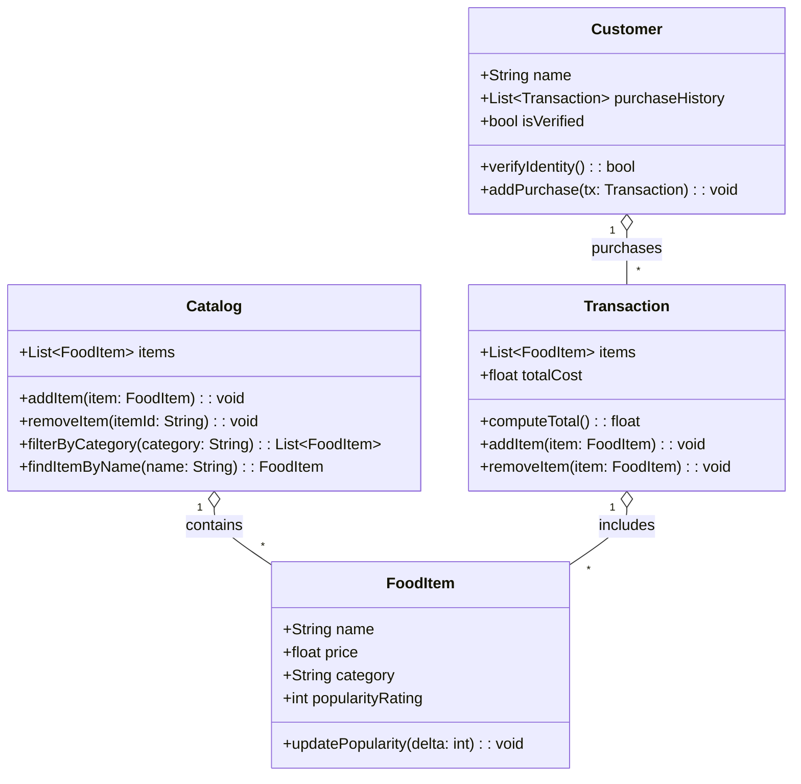

# ByteBites Design — UML Class Diagram

This file contains a revised UML class diagram for the core backend classes.

Notes:
- `Customer` stores name and a list of past `Transaction`s and can verify identity.
- `FoodItem` holds item details: name, price, category, and popularity rating.
- `Catalog` manages a collection of `FoodItem`s and supports filtering by category.
- `Transaction` groups selected `FoodItem`s and computes the total cost.
